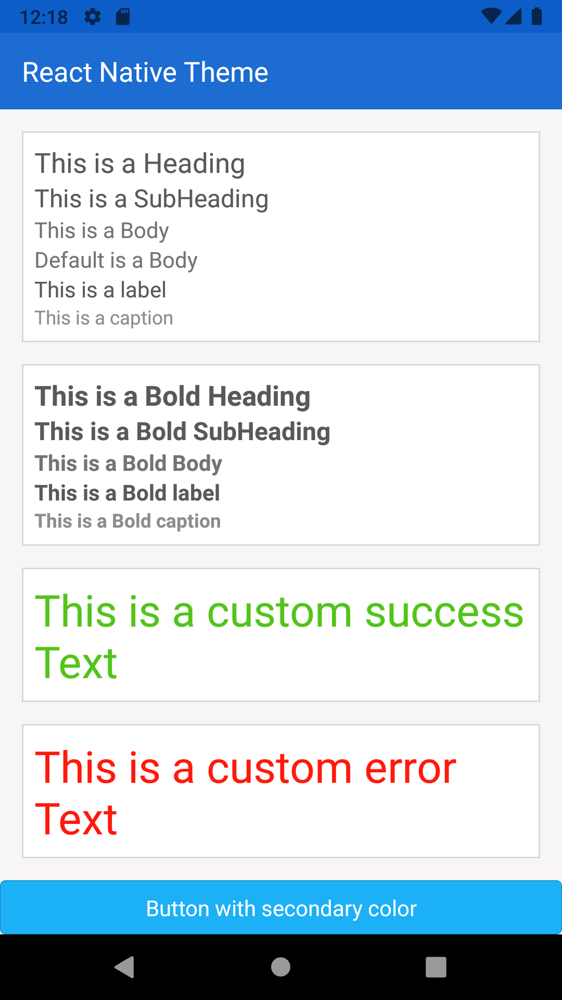
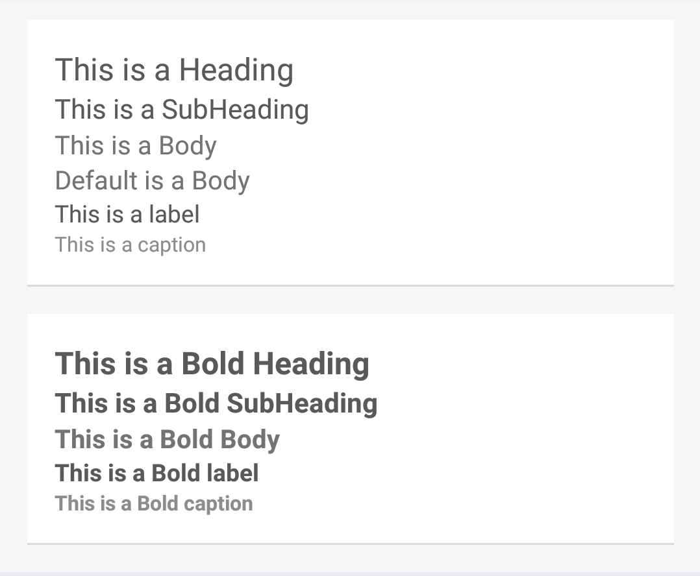

<hr>
<p align="center">
  <b>Work In Progress, though star this repo :wink:</b>
</p>
<hr>

# React Native Theme

<div style="display:flex;" >
  
</div>

React Native theme is a single source of truth for your App Design. It's a scalable theme for your React Native project. You can easily integrate it in your workflow, and modify entire look of your app in seconds. The basic idology can be implemented outside React Native realm.

## :sparkles: Inspiration 

In entire app, `colors`, `typography` and values for `margin`/`padding`/`height`/`width` are typically defined in each component, which makes it hard to change. This `theme` module, defines all colors, typography and sizes at a single place, so that only few changes in value can change the overall look of the app.

## Table of Contents

- `theme.js` - combine `colors.js`, `typography.js`, `spacing.js` & `dimens.js` into single module
- `colors.js` - where all colors used in entire app are defined
- `typography.js` - all typography related style are defined
- `spacing.js` - common padding/margin value defined
- `dimens.js` - component custom width/height are defined here

## :rocket: Getting Started

**Instructions**

- Copy the [theme](theme/) folder and place it in your APP.
- Copy [`Text`](component/Text.tsx) component and paste it in your component folder.

### Theme

Theme is implemented by creating sepearte file for colors, spacing, typography and combining it in single file, and accessing it using `React Context`. Follow below steps to import `theme` object in your component.

**For Functional Component**
```javascript
import React, { useContext } from 'react';
import { ThemeContext } from './theme';
//...
const CustomComponent = props => {
    const theme = useContext(ThemeContext);
    //...
    return <View style={{ backgroundColor: theme.colors.background }} />
}
```

**For Class Component**
```javascript
import React from 'react';
import { ThemeContext } from './theme';
//...
class CustomComponent  extends React.Component {
    static contextType = ThemeContext;
    //...
    render() {
        const theme = this.context;
        return <View style={{ backgroundColor: theme.colors.background }} />
   }
}
```

### :art: Colors

Color palette is inspired(stolen) from [Google Material Design](https://material.io/). There are two major colors `primary` which represents brand color and `secondary` which represents accent color.

| Color Name | Color Use |
|---|---|
| primaryDark | To be used for status bar and for dark tint |
| primary | To be used as a background color for appbar(toolbar) |
| appBarTint | To be used for appbar title text, appbar icons color and for back button |
| secondaryLight | To be used for hover state |
| secondary| to be used as default button, checkbox, spinner, radio button and other component color |
| secondaryDark | to be used for active state |
| background | Every Screen will have this as his default background color |
| surface | To be used as a default background for all components, like Card, CardSection, List etc |
| border | Use it for card border |
| titleText | To be used for heading, subheading, label text |
| bodyText | To be used for normal text like paragraph |
| captionText | To be used for hint text component, or of less importance |
| success | Success messages and icons. |
| error | Error messages and icons. |

> TODO: Insert Image to showcase color palette visually.

> If `primary` is dark make `appBarTint` color light, and vice versa.
> If `surface` is dark make `titleText`, `bodyText` & `captionText` light, and vice versa.

:heavy_check_mark: Do this

```javascript
<View style={{ backgroundColor: theme.colors.background }}>
    <View style={{ borderColor: theme.colors.border }}>
```
:x: Don't do this

```javascript
<View style={{ backgroundColor: '#222' }}>
    <View style={{ borderColor: '#eee' }}>
```

### :black_nib: Typography

| Name | value | variant |
|---|---|---|
| titleText | Use for the title of a screen(Toolbar) & the titles of Modal dialogs | bold |
| headingText | Use for card titles | bold |
| subheadingText | Use for new sections within cards | bold |
| bodyText | Default style | bold |
| labelText | Use for form field and input elements | bold |
| captionText | Use the for help/hint text | bold |

> TODO: Insert image depicting different text style used in Screen

A custom [`Text`](component/Text.tsx) component has been defined in `component` folder, which uses typography styles from `typography.js`. Use this `Text` component to understand how typography is implemented.

```javascript
<Text type="heading">This is a Heading</Text>
<Text type="subheading">This is a SubHeading</Text>
<Text type="body">This is a Body</Text>
<Text>Default is a Body</Text>
<Text type="label">This is a label</Text>
<Text type="caption">This is a caption</Text>
---
<Text type="heading" bold>This is a Bold Heading</Text>
<Text type="subheading" bold>This is a Bold SubHeading</Text>
<Text type="body" bold>This is a Bold Body</Text>
<Text type="label" bold>This is a Bold label</Text>
<Text type="caption" bold>This is a Bold caption</Text>
```



:heavy_check_mark: Use custom [`Text`](component/Text.tsx) component in App
```javascript
import { Text } from './component/Text'; // import Text component from component folder
//...
return (
    <View>
        <Text>Text which is theme aware</Text>
    </View>
);
```

:x:  Don't do this
```javascript
import { Text } from 'react-native';
```

### :straight_ruler: Spacing

Spacing should be consistent and whitespace thought of as a first class technique up there with color and typefaces. Define preset for spacing which will be used for `padding` and `margin` value. 

| Name | Value |
|---|---|
| tiny | 4 |
| small | 8 |
| medium | 12 |
| large | 16 |

> If required, add more like `extraLarge` etc.

:heavy_check_mark: Do this

```javascript
<View style={{ padding: theme.spacing.large }}>
    <Text style={{ margin: theme.spacing.tiny }}>
```
:x: Don't do this

```javascript
<View style={{ padding: 16 }}>
    <Text style={{ margin: 4 }}>
```

### :triangular_ruler: Dimensions

App contain several cutom values from image height, width to a view border radius. Define all numerical sizes used in app in [`dimens`](theme/dimens.ts) file.

:heavy_check_mark: Do this
- Define custom sizes in `dimens` file
```javascript
{
    customComponentHeight: 234,
    customComponentWidth: 345,
    //...
}
```
- In you `CustomComponent` access the property like
```javascript
<Image style={{
        width: theme.dimens.customComponentWidth,
        height: theme.dimens.customComponentHeight,
    }}>
```

## 🤝 Contributing [](http://makeapullrequest.com) 

:star: If you like what you see, star us on GitHub.

Finding bugs, sending pull requests or improving docs - any contribution is welcome and highly appreciated. To get started, head over to our [contribution guidelines](CONTRIBUTING.md). Thanks!

## :books: Projects using this theme module

- [MageCart: E-commerce App](https://github.com/alexakasanjeev/magento_react_native)
- [magento-react-native](https://github.com/troublediehard/magento-react-native)

## :man: Authors

* **Sanjeev Yadav** - [alexakasanjeev](https://github.com/alexakasanjeev)

See also the list of [contributors](https://github.com/alexakasanjeev/react-native-theme/contributors) who participated in this project.

## :page_facing_up: License

This project is licensed under the GNU v3 Public License License - see the [LICENSE.md](LICENSE.md) file for details.

## :bulb: Acknowledgements

* [Google Material Design](https://material.io/) created by Google
* [Reaction Commerce Design System](https://designsystem.reactioncommerce.com/) create by [Reaction commerce](https://github.com/reactioncommerce)
* [README-Template.md](https://gist.github.com/PurpleBooth/109311bb0361f32d87a2) by [Billie Thompson](https://github.com/PurpleBooth)
